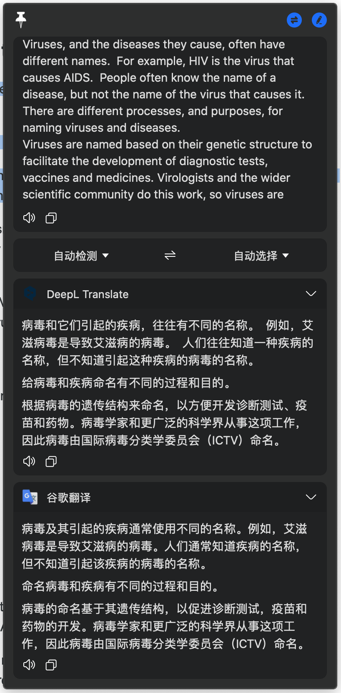

# bob-plugin-deepl-translate

这是一个 [Bob](https://ripperhe.gitee.io/bob/#/) 使用的 DeepL 翻译插件。

你需要有一个 DeepL 的 API Token 才可以使用本插件。

## 安装

1. 安装 Bob (version >= 0.5.0)
2. 下载插件 [releases](https://github.com/geekdada/bob-plugin-deepl-translate/releases)
3. [安装插件](https://ripperhe.gitee.io/bob/#/general/quickstart/plugin?id=%e5%ae%89%e8%a3%85%e6%8f%92%e4%bb%b6)

## 配置

- `formality` 正式程度： 设置翻译后的文本是倾向于正式语言还是非正式语言。此功能目前适用于所有目标语言，除了英语、英式英语、美式英语、西班牙语、汉语和日语。

## Sub DeepL

每个月最少 2.5 美元即可使用 DeepL API，详情请见 [sub-deepl.royli.dev](https://sub-deepl.royli.dev?utm_source=github&utm_medium=readme)。

## 注意

### 字符是如何计费的？

> DeepL API 计划对你的翻译量没有限制，并按字符数计算你的使用量。 计算的字符是源文本中的字符，也就是你要翻译的原文。
>
> 一个字符对应于一个 unicode 代码点，其中一个字符可以由多个字节组成。 例如，字符 é 在 UTF-8 中被表示为两个字节。 然而，DeepL 只将其视为一个字符。 隐形字符，如空格、制表符、换行符等也会被计算在内。
